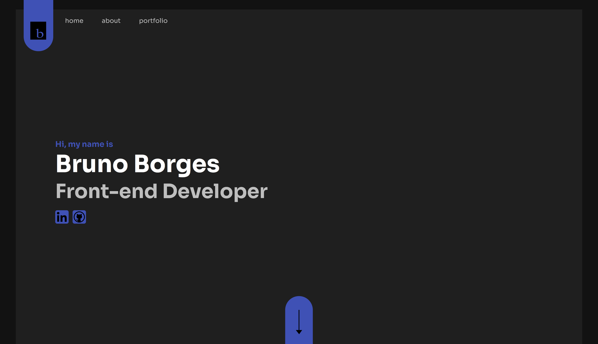

# Bruno Borges - Portfolio

Bilingual (en-US / pt-BR) single-page portfolio built with React, TypeScript and Vite. Live at <https://brunoborges.netlify.app>.

## Stack

- React 19, TypeScript, Vite
- styled-components 6 (theme in `src/assets/styles/Themes/default.tsx`)
- i18next + react-i18next + i18next-browser-languagedetector
- react-scroll (section navigation), react-intersection-observer (About animation)
- Vitest + Testing Library (happy-dom), ESLint, Prettier
- Deployed on Netlify (`netlify.toml`)

## Getting started

Requires Node 20+ (`.nvmrc` pins 22) and yarn.

| Command              | What it does                          |
| -------------------- | ------------------------------------- |
| `yarn dev`           | Dev server at <http://localhost:5173> |
| `yarn build`         | Type-check and build to `dist/`       |
| `yarn preview`       | Serve the production build            |
| `yarn test`          | Run the unit/component tests          |
| `yarn test:coverage` | Tests with the 80% coverage gate      |
| `yarn lint`          | ESLint                                |
| `yarn typecheck`     | `tsc -b --noEmit`                     |

## Visitor counter

The footer shows a unique-visitor count served by a small AWS backend in [`backend/`](./backend) (Lambda Function URL + DynamoDB, see its README). Each browser gets a random anonymous id in `localStorage` and is counted once. The frontend reads its URL from `VITE_VISITOR_API_URL` (see `.env.example`); when unset, the counter is hidden.

## Languages

Copy lives in `src/i18n/locales/en-US.json` and `pt-BR.json`. The language is picked from `localStorage` (`lang`), then the browser language (any `pt-*` maps to pt-BR), then falls back to en-US. `useDocumentMeta` keeps `<html lang>`, the title and the meta description in sync.

To add a language:

1. Add the code to `SUPPORTED_LANGUAGES` and a prefix mapping in `src/i18n/languages.ts`.
2. Create `src/i18n/locales/<code>.json` with exactly the same keys (a test fails if the keys, or the interpolation placeholders, differ).
3. Register it in `src/i18n/index.ts` and add a button in `LanguageSwitcher`.

## Projects

Projects are declared in `src/data/projects.ts` (links, stack, media) and described in the locale files under `projects.<slug>`.

- **Featured** projects appear in the slider and need `summary` and `highlights` in every language.
- **Experiments** appear in the compact "More experiments" list and only need `summary`.
- **Private (company) projects** must not have `github`, `github2` or `live` (a test enforces it). Without a `screenshot` they render a designed placeholder. Only add screenshots or video you have permission to publish.

## Testing

Tests sit next to the code (`*.test.ts(x)`). Locale parity, project data rules, the slider, the About section, the footer and the language switcher are covered. Coverage excludes styles, assets and the entry file.
